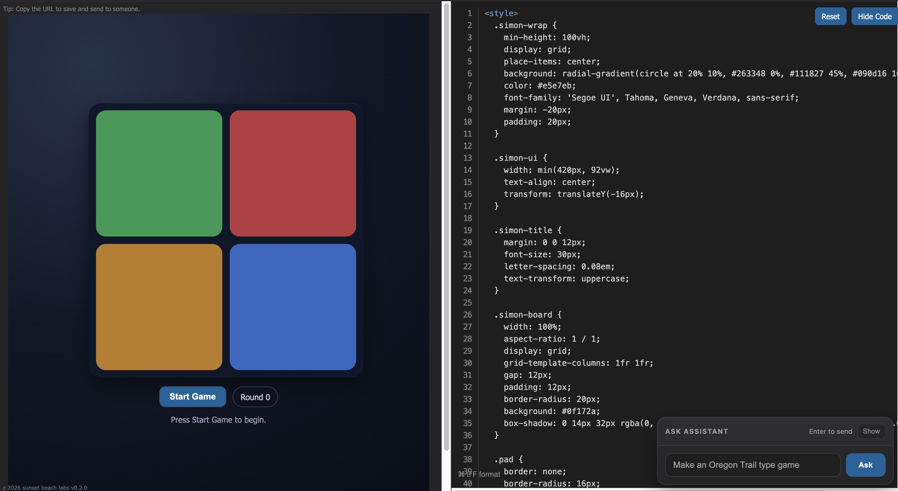

<h1 align="center">CodeSprout</h1>
<p align="center"><strong>Code it. Preview it. Share it.</strong></p>

CodeSprout is a browser-based HTML/CSS/JS playground with live preview, syntax highlighting, URL sharing, and an AI SmartBox assistant.

Live site: https://qeditor.dev



## Features

- Live HTML/CSS/JS editing with Prism line-number highlighting
- Keyboard formatting with Prettier (`Cmd+Shift+F` / `Ctrl+Shift+F`)
- Shareable URLs (code is compressed into `location.hash`)
- Auto-save to `localStorage`
- SmartBox AI generation + one-click copy into editor
- SmartBox response panel `Show/Hide` toggle
- `Hide Code` / `Show Code` toggle for the editor panel
- Reset controls to clear saved state and reload
- Mobile layout: preview + SmartBox only

## Security Model (Preview)

User code is rendered in a sandboxed iframe (`allow-scripts`) with a restrictive CSP.  
This isolates preview execution from the main app UI and reduces injection risk against the editor shell.

## Default Starter

The default starter is a Simon-style memory game (HTML/CSS/JS) so new sessions open with a playable demo.

## Usage

- Type code in the editor panel
- Format with `Cmd+Shift+F` / `Ctrl+Shift+F`
- Toggle code panel using `Hide Code` / `Show Code`
- Reset with the `Reset` button
- Share work by copying the URL

## SmartBox

Behavior:
- Starts with animated prompt suggestions
- Keeps response collapsed by default
- Lets you manually expand responses with `Show`
- Normalizes/sanitizes generated output before inserting into the editor

## Local Development

No build step is required. Serve the folder statically, for example:

```bash
python3 -m http.server 4173
```

Then open `http://127.0.0.1:4173`.

## Terminal Container (macOS)

QEditor's Terminal button connects to `http://localhost:7681` (served by `ttyd`).

Runtime behavior:
- These scripts use Apple's `container` command on macOS.
- For other platforms, edit `container/start.sh`, `container/build.sh`, and `container/stop.sh` to use your preferred runtime.

To run the container locally:

1. Download `container.zip` from the app fallback panel and unzip it.
2. Open Terminal, `cd` into the unzipped `container` folder, and start the container:
   ```bash
   ./start.sh
   ```
3. Click the `Terminal` button in QEditor.

Stop the container when done:

```bash
./stop.sh
```

If you already have your own `ttyd` container or host at port `7681`, QEditor can connect to that instead.

## Notes

- The app is intentionally client-side and stateful via URL hash + localStorage.
- If favicon, CSS, or scripts appear stale, hard refresh to bypass cache.
